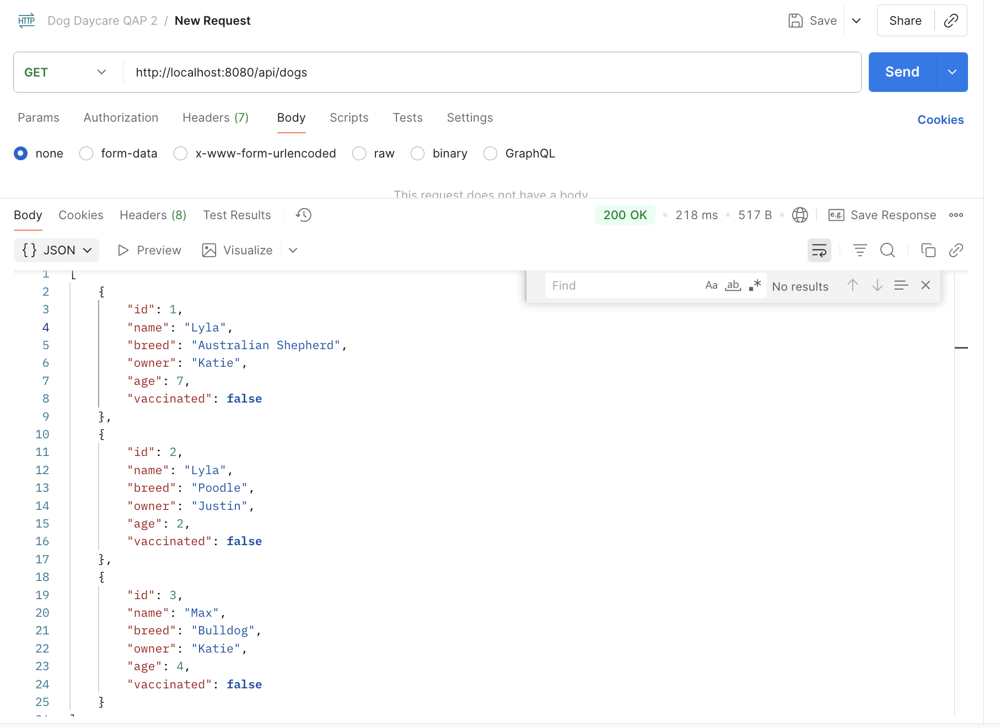
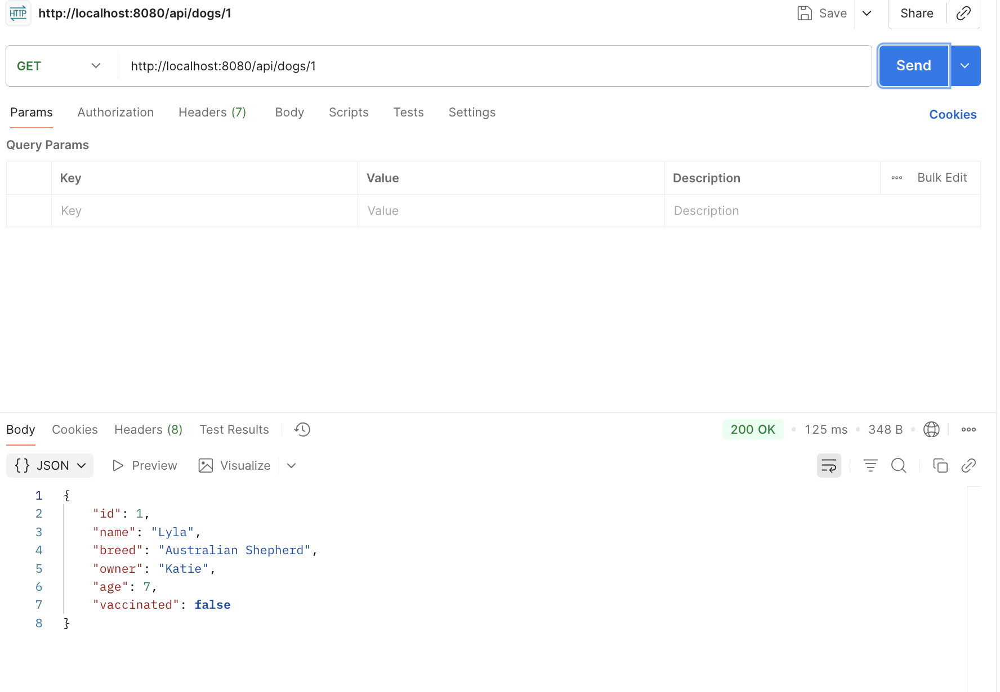
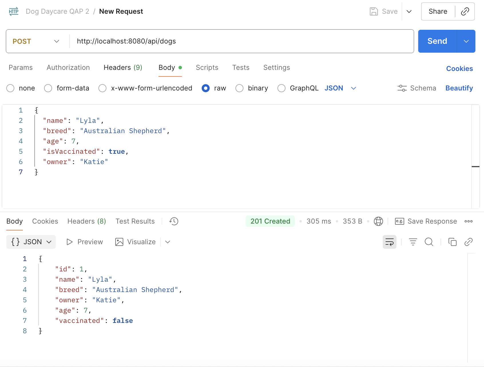
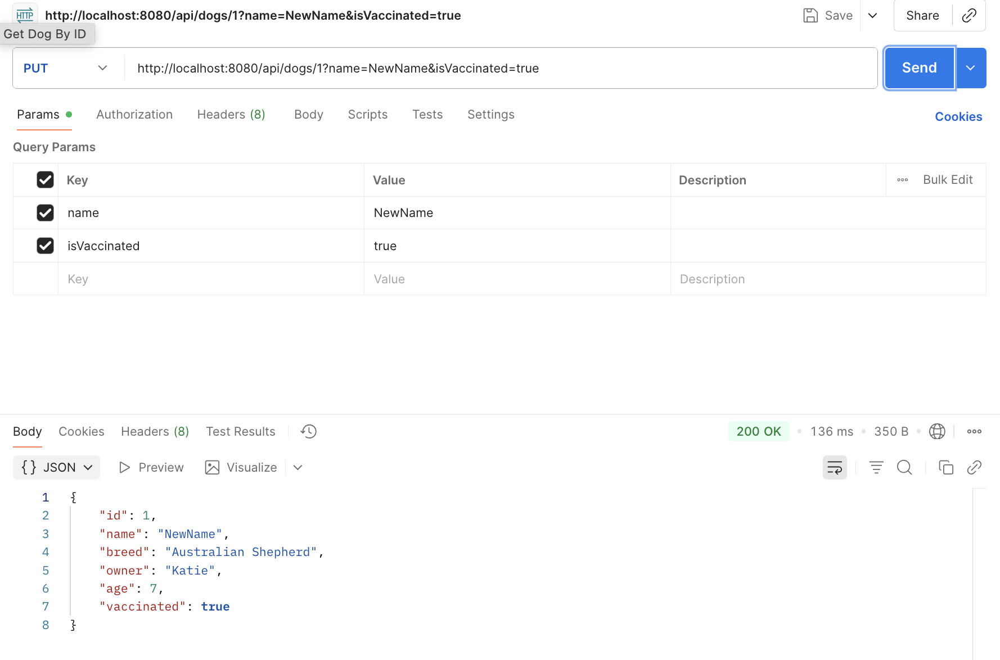
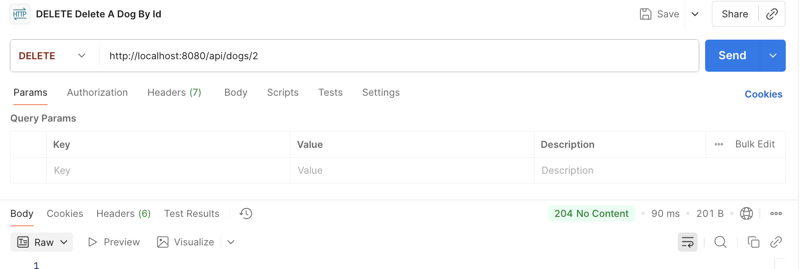
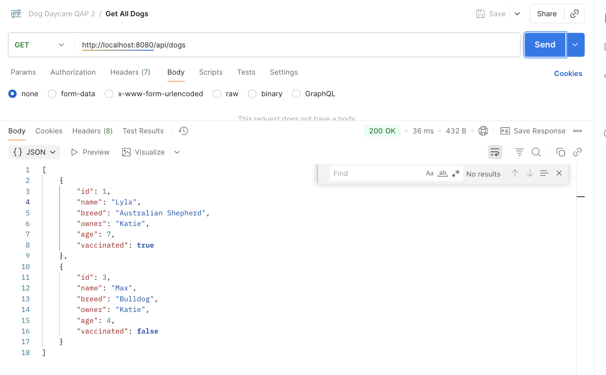
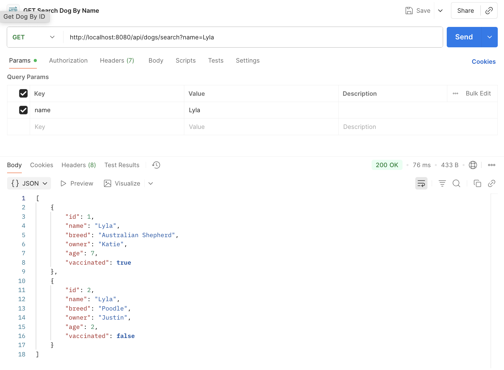
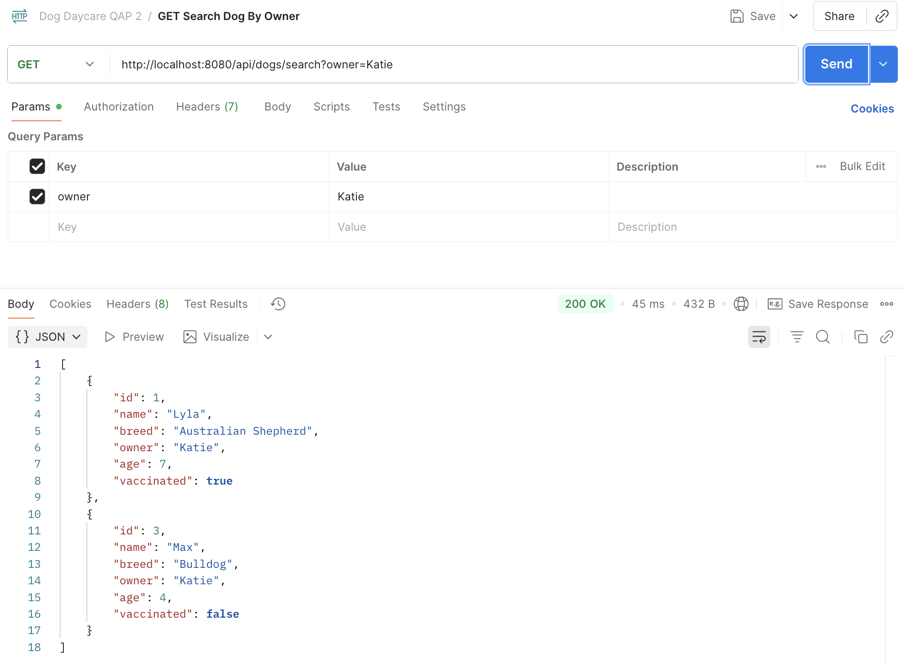

# Dog Daycare — Spring Boot CRUD API

## Overview

Dog Daycare is a simple Spring Boot REST API that provides CRUD operations for a Dog entity backed by a MySQL database. It exposes endpoints to create, read, update (partial updates supported), delete, and search dogs by name or owner.

## Features

- RESTful endpoints for Dog management (GET, POST, PUT, DELETE)
- Search endpoints to find dogs by `name` or `owner`
- Partial updates supported via optional request parameters on the PUT endpoint
- Automatic schema updates via Hibernate `ddl-auto=update`
- Technologies: Spring Boot, Spring Data JPA, MySQL, Postman (recommended), Swagger UI (optional)

### Dog entity fields

- `id` (Long, auto-generated)
- `name` (String, required)
- `breed` (String, required)
- `isVaccinated` (boolean, required)
- `owner` (String, required)
- `age` (int, required)

### Endpoints (root: `/api/dogs`)

- `GET /api/dogs` — list all dogs
- `GET /api/dogs/{id}` — retrieve a dog by id
- `GET /api/dogs/search?name={name}` — find dogs by name
- `GET /api/dogs/search?owner={owner}` — find dogs by owner
- `POST /api/dogs` — create a new dog (JSON body)
- `PUT /api/dogs/{id}` — update an existing dog (partial updates via optional query params)
- `DELETE /api/dogs/{id}` — delete a dog by id

## Class Descriptions

- `com.QAP2.DogDayCare.Dog` (Entity)
  - JPA entity mapped to `dog` table. Contains fields: `id`, `name`, `breed`, `isVaccinated`, `owner`, `age` with getters/setters and a no-arg constructor.

- `com.QAP2.DogDayCare.DogRepository` (Repository)
  - Extends `JpaRepository<Dog, Long>` and provides query methods `findByName(String)` and `findByOwner(String)`.

- `com.QAP2.DogDayCare.DogService` (Service)
  - Business logic layer. Methods:
    - `getAllDogs()` — returns all dogs
    - `getDogById(Long)` — returns dog or `null` if not found
    - `findByName(String)` / `findByOwner(String)` — query methods
    - `createDog(Dog)` — saves a new dog
    - `updateDog(Long, ...optional fields...)` — performs partial update of provided fields
    - `deleteDogById(Long)` — deletes by id

- `com.QAP2.DogDayCare.DogController` (Controller)
  - REST controller mapped at `/api/dogs`. Delegates to `DogService` and maps HTTP verbs to service operations. Returns appropriate `ResponseEntity` statuses (200, 201, 204, 400, 404).

- `com.QAP2.DogDaycareCrudApplication` (Main)
  - Application entry point. Bootstraps the Spring Boot application.

## Setup Instructions

These instructions assume macOS and `zsh` (adjust commands for other environments).

1. Clone the repository

```bash
git clone https://github.com/JustinGreenslade/QAP2-Dog-DayCare
cd QAP2-Dog-DayCare
```

2. Install Java and Maven

- Java 24
- Maven 3.6+

3. Configure MySQL

- Start MySQL and create the database used by the app (`dog_daycare`) or update `application.properties` to match your DB setup.

Example SQL to create database and a dedicated user:

```sql
CREATE DATABASE dog_daycare;
CREATE USER 'dog_user'@'localhost' IDENTIFIED BY 'strong_password';
GRANT ALL PRIVILEGES ON dog_daycare.* TO 'dog_user'@'localhost';
FLUSH PRIVILEGES;
```

4. Update `src/main/resources/application.properties` with your database settings (example already provided in the project):

```properties
spring.jpa.hibernate.ddl-auto=update
spring.datasource.url=jdbc:mysql://localhost:3306/dog_daycare
spring.datasource.username=root
spring.datasource.password=Keyin2024
spring.datasource.driver-class-name=com.mysql.cj.jdbc.Driver
spring.jpa.show-sql=true
```

Change `spring.datasource.username` and `spring.datasource.password` to the credentials you configured.

5. Build and run

- Run with Maven (recommended during development):

```bash
mvn spring-boot:run
```

- Or build the JAR and run:

```bash
mvn -DskipTests package
java -jar target/QAP2-Dog-DayCare-1.0-SNAPSHOT.jar
```

The application will start on port 8080 by default. You can change the port in `application.properties`.

## Postman Testing (screenshots)

Use Postman or a similar tool to exercise the API. Below are example request summaries with the corresponding screenshots from the `Screenshots/` folder. These images are referenced with relative paths from the repository root; update paths if you move the files.

- GET all dogs — screenshot:

  

- GET dog by id — screenshot:

  

- POST create dog (JSON body) — screenshot:

  

- PUT update dog (partial update via params) — screenshot:

  

- DELETE dog by id — screenshot:

  

- State after delete (list view) — screenshot:

  

- GET search by name — screenshot:

  

- GET search by owner — screenshot:

  

Example JSON body for POST /api/dogs:

```json
{
  "name": "Buddy",
  "breed": "Labrador",
  "age": 3,
  "isVaccinated": true,
  "owner": "Alice"
}
```

Notes on using the PUT endpoint for partial updates (example):

- URL: `PUT /api/dogs/{id}`
- Provide only the fields you wish to update as query parameters, e.g.: `PUT /api/dogs/1?name=Max&age=4`

## Notes & Considerations

- Partial updates: `DogService.updateDog` applies only parameters that are non-null, enabling partial updates.
- Automatic table creation: `spring.jpa.hibernate.ddl-auto=update` creates/updates tables automatically during development; use migration tools (Flyway/Liquibase) for production.
- Credentials in `application.properties`: the repository currently contains a plaintext password — avoid committing secrets in real projects. Use environment variables or Spring Cloud config for production.
- Swagger UI: not included by default in this project. If you add `springdoc-openapi-ui` (or springfox), Swagger UI will be available at `/swagger-ui.html` or `/swagger-ui/index.html` depending on the library.

